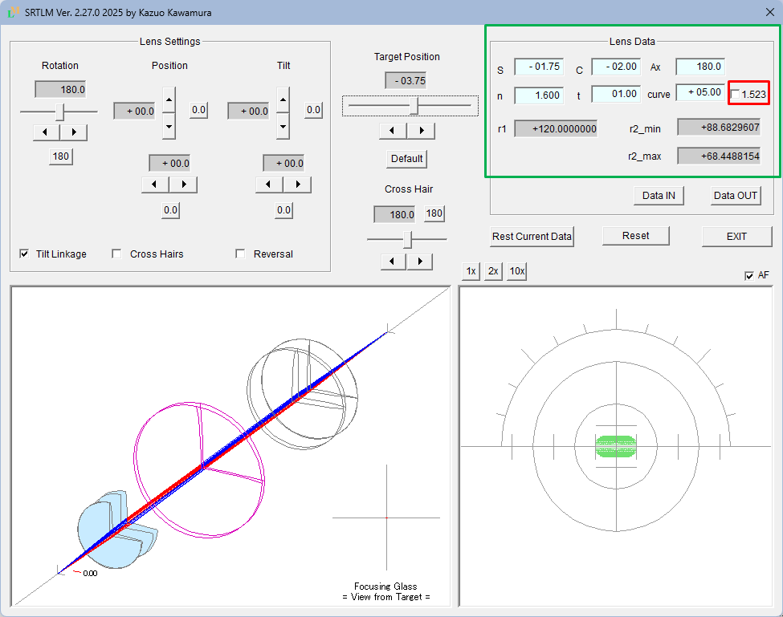

# SRTLM (Skew Ray Trace for Lens Meter) - Lensmeter Simulation Tool

[English](README.md) | [日本語](README_ja.md)

This is a simulation tool of a **Lensmeter**, an optical instrument used for measuring lens power.
The tool traces and visualizes rays passing through the lens system (including the tested lens) in 3D,
displaying the imaging state on the focusing screen.

This tool is developed as a dialog-based application using **Visual Studio C++ (MFC)**.

---

## Features
- Ray tracing of tested lens, including toric lens
- Visualization of the image formation
- Adjustable lens parameters (save and load functions included as standard)
- Educational use for students and researchers in optics

---

## Requirements
- Visual Studio 2017 (or later)
- Windows 10/11

---

## Build Instructions
1. Open `Lensmeter.sln` in Visual Studio.
2. Select **Build > Build Solution**.
3. Run the generated executable.

---

## License
This project is licensed under the **MIT License**.
See [LICENSE](LICENSE) for details.

---

## Files
- `src/en/` : English Source code (UTF-8, BOM)
- `src/ja/` : Japanes Source code (UTF-8, BOM), Note: Only the resource script file (`SRTLM.rc`) uses Shift-JIS encoding
- `images/` : Screenshots and diagrams
- `LICENSE` : License information

---

## Author
Kazuo Kawamura
[https://kotan2718.github.io/](https://kotan2718.github.io/)

---

## Screenshots

Here is an example of the English UI.

---

### Special Notice Concerning DpNumCtrl
This software contains code based on the DpNumCtrl class developed by Mr. Masakazu Irie.
This code has been modified by me (Kazuo Kawamura) for use with SRTLM.

For the sections originating from DpNumCtrl, if the original author requests
the removal or modification of the relevant sections, such requests will be honored promptly.

---

