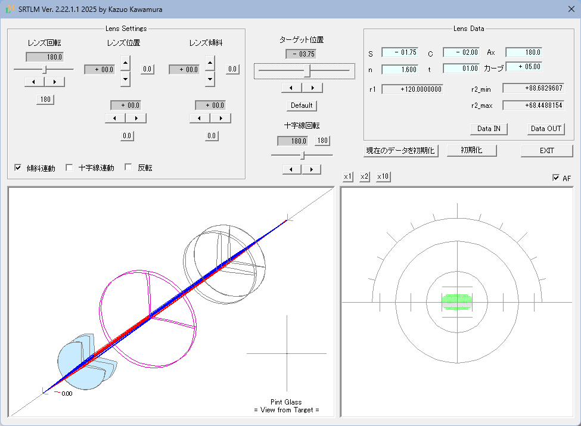

# SRTLM(Skew Ray Tracing for Lens Meter) - レンズメーター シミュレーションツール

[日本語](README_ja.md) | [English](README.md)

これは、レンズの屈折力を測定するために使用される光学機器である **レンズメーター** のシミュレーションツールです。

被検レンズを含むレンズメータを構成するレンズ系を通過する光線を3Dで追跡及び視覚化し、ピントグラスウインドウに結像状態を表示します。

このツールは、**Visual Studio C++ (MFC)** を使用してダイアログベースのアプリケーションとして開発されています。

---

## 機能
- トーリックレンズを含む被検レンズの光線追跡
- 結像の視覚化
- 調整可能なレンズパラメータ(保存、呼び出し機能標準装備)
- 光学を学ぶ学生や研究者のための教育用

---

## 要件
- Visual Studio 2017 (以降)
- Windows 10/11

---

## ビルド手順
1. Visual Studio で `Lensmeter.sln` を開きます。
2. **[ビルド] > [ソリューションのビルド]** を選択します。
3. 生成されたexeファイルを実行します。

---

## 実行ファイル及びドキュメントの入手先

[https://kz-page.la.coocan.jp/etc_SRTLM.html](https://kz-page.la.coocan.jp/etc_SRTLM.html)

---

## ライセンス
このプロジェクトは、**MIT ライセンス** に基づいてライセンスされます。
詳細は[ライセンス](ライセンス)をご覧ください。

---

## 構成ファイル
- `src/en/` : 英語版ソースコード (UTF-8, BOM)
- `src/ja/` : 日本語版ソースコード (UTF-8, BOM)、ただし、リソーススクリプトファイル（`SRTLM.rc`）のみ Shift-JIS
- `images/` : スクリーンショット
- `LICENSE_ja.txt` : 日本語版ライセンス情報

---

## 作者
川村 一夫
[Contrail (GitHub Pages)](https://kotan2718.github.io/Contrail/)
[Lensmeter Simulation Tool (GitHub Pages)](https://kotan2718.github.io/Lensmeter-Simulation-Tool/)

---

## スクリーンショット

日本語版の実行画面です。

---

### 文字エンコーディングに関する注意事項

ソースコードファイルは**UTF-8 (BOM付き)**でエンコードされています。
日本語版のみリソーススクリプトファイル（`SRTLM.rc`）は、Visual Studioのリソースコンパイラの制限により
**Shift_JIS (CP932)**でエンコードされています。

---

### DpNumCtrlに関する特記事項

本ソフトウェアには、入江征和氏が開発したDpNumCtrlクラスをベースにしたコードが含まれています。

当該コードは、私（川村一夫）がSRTLM 用に修正を加えたものです。

DpNumCtrl に由来する部分については、入江氏より削除や変更の要請があれば、速やかに対応します。

---

